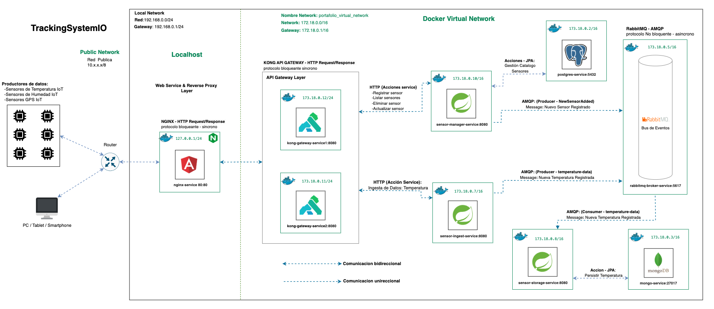
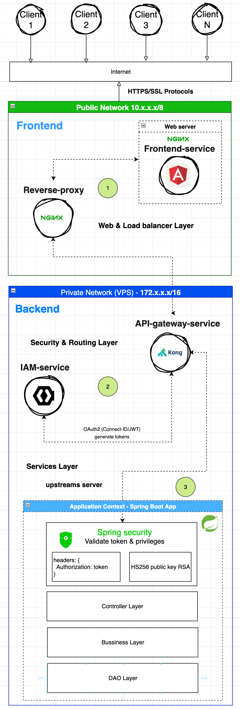

# Tracking System IOT


🧾 Descripción general
Esta aplicación está diseñada con una arquitectura distribuida orientada a eventos para ingerir, procesar y transformar datos provenientes de múltiples fuentes, principalmente sensores IoT. También permite notificar eventos críticos a los usuarios del sistema y mantener datos confiables mediante procesos de transformación estructurados.

📡 Productores de datos
- Sensores IoT de temperatura
- Sensores IoT de posición GPS
- Sensores IoT de humedad
- Scripts de prueba o simuladores (para entornos de desarrollo/testing)

## Estructura General
📂 Estructura del Dominio Lógico
```bash
TrackingSystemIOT/    # Raíz del proyecto (Dominio principal)
│ 
├── security/        # 1. Seguridad de la APP
│   ├── load-balancer/     # Encargado de distribuir tráfico y aplicar primeras reglas de acceso 
│   ├── oauth2/            # Gestión de identidad y autenticación 
│   ├── api-gateway/       # Enrutamiento y seguridad de APIs
│   ├── test/              # scripts para realizar pruebas de integracion entre los servicios oauth2 y el api gateway.
│   ├── docker-compose.security.yml/   # Archivo Docker compose para gestionar volumenes,servicios, redes.
│   └── readme.md
│
├── ingestion-process/                # 2. Captura de datos crudos desde dispositivos o APIs
│   ├── IngestionService/             # Entrada principal de datos crudos (IoT, eventos)
│   ├── EventService/                 # Procesa alertas/reglas en tiempo real
│   ├── SensorRegistryService/        # Relaciona sensores con clientes, tipos y ubicaciones
│   ├── docker-compose.ingestion.yml/   # Archivo Docker compose para gestionar volumenes,servicios, redes.
│   └── readme.md
│
├── master-data/                      # 3. Datos de referencia para contextualizar las lecturas
│   ├── SensorCatalogService/         # Tipos, fabricantes, modelos, métricas de sensores
│   ├── ClientSensorService/          # Sensores físicos instalados por cliente
│   ├── LocationService/              # Ubicaciones físicas de los sensores
│   ├── docker-compose.master.yml/   # Archivo Docker compose para gestionar volumenes,servicios, redes.
│   └── readme.md
│
├── transformation-process/ (futuro)  # 4. ETL: transforma datos crudos en datasets confiables
│   ├── ReaderService/                # Lee datos de Ingestion DB, Kafka, S3, etc.
│   ├── TransformationService/        # Normaliza, valida, enriquece (Spring Batch, Spark, etc.)
│   ├── LoaderService/                # Carga en base de datos curada ("gold layer")
│   ├── batch-jobs/                   # Definiciones de Spring Batch jobs, YAML/Java config
│   ├── infra/                        # DB staging, configuración ETL, colas, S3
│   ├── docker-compose.transformation.yml/   # Archivo Docker compose para gestionar volumenes,servicios, redes.
│   └── readme.md
│
├── Consumption-process/ (futuro): dashboards, reportes, IA, notificaciones
│   
├── shared/                           # Librerías y contratos reutilizables
│   └── libs/                         # DTOs, modelos, eventos, utils compartidos (Java libs)
│
├── scripts/                         # Scripts Bash de utilidad globales, pruebas de integracion entre dominios.
│   
├── docker-compose.yml/   # Archivo Docker compose para gestionar volumenes, servicios, redes globales de toda la aplicación.
└── readme.md             # Documentacion global de la aplicacion
```

📦 Subdominios funcionales
🔹 ingestion-process/
Responsable de recibir, validar y almacenar datos crudos provenientes de los sensores. También se encarga de emitir eventos relevantes cuando las lecturas superan umbrales críticos o requieren atención inmediata.

🔹 security/
Contiene los componentes de seguridad y control de acceso. Implementa OAuth2/OpenID Connect para autenticación, y un API Gateway como único punto de entrada para exponer y proteger los servicios distribuidos de la plataforma.

🔹 master-data/
Encargado de la gestión del catálogo de sensores y su relación con clientes y ubicaciones. Ofrece operaciones de alta, baja, modificación y consulta, accesibles a través de una interfaz web (UI) o API, facilitando la administración centralizada del modelo de datos.

🔹 transformation-process/
Encargado del procesamiento de datos crudos en distintos modos: batch, micro-batch o en tiempo real, según el tipo de dato o criticidad del evento. Su objetivo es generar datasets confiables (gold layer) que sirvan para análisis, visualización y generación de valor.

### Architectura
**Orientado a microservicios con enfoque a eventos**

El proyecto está diseñado con una arquitectura orientada a microservicios, con un enfoque basado en eventos. Implementando servicios redundantes para tolerar la carga en la red.



## Tecnologías

## Capa Web 

**Nginx**: utilizado como proxy reverso y como servidor web para archivos estáticos. Encargado de distribuir el trafico en la red entre los servicios redundantes api kong gateway. Y para despachar archivos estáticos.

**Angular**: Como aplicación web para proporcionar interfaces intuitivas para poder gestionar los sensores IoT a través de una UI gráfica.

## Capa Api Gateway 
La capa API Gateway esta conformada por los servicios: kong, kong UI, keycloak y nginx.

**Nginx**: Es utilizado como proxy reverso. Encargado de distribuir el trafico en la red entre los servicios redundantes api kong gateway.

**Kong Api Gateway**: Kong API Gateway funciona como unico punto de acceso a la aplicacion sirviendo como intermediario a los servidores de fondo.

**keycloak**: Es un servidor IAM dedicado para gestionar accesos a través de la validacion de la autenticación y autorización de los clientes que intentan acceder a la aplicación. Esta validación se realiza mediante el alta de usuarios en la aplicacion.

<div style="display:flex; justify-content: center">
  
</div>

## Capa de servicios

**Ecosistema Spring**:
  - **Spring Boot** Para crear servicios api REST y gestionar comunicaciones HTTP.
  - **Spring JPA**: Para interactuar con las bases de datos a traves de la abstraccion y mapeo de las tablas y sus atributos en objetos.
  - **Base de datos H2** (para pruebas): Base de datos en memoria para realizar testing y validar tanto entradas como salidas de procesos.

**Mockito & Junit5** (para pruebas): Para generar pruebas, y validar entrada y la salida de procesos a traves del mockeo de dependencias.

**PostgreSQL**: Para almacenar datos relativos a los sensores IoT dados de alta en la aplicación y sus catalogos correspondientes.

**MongoDB**: Para almacenar los datos provenientes de lecturas de los sensores IoT ingeridos de forma masiva por la aplicación.

**Docker y Docker-Compose**: utilizados para probar, construir y desplegar los microservicios en contenedores docker desplegados en la infraestructura de la red docker.

**RabbitMQ**: Utilizado para recibir y enviar mensajes asincronos a traves de la abstracion de un canal de comunicación entre microservicios.

## Para comenzar

### Pre-requisitos

- [Docker Engine](https://www.docker.com/)
- [Docker Compose](https://docs.docker.com/compose/)
- [Java 17+ Correto](https://www.oracle.com/java/technologies/javase-downloads.html) (para ejecutar aplicaciones Spring Boot)
- [Servidor PostgreSQL](https://www.postgresql.org/) (para gestionar catálogos de sensores)
- [Servidor MongoDB](https://www.mongodb.com/) (para almacenar datos de los sensores)
- [Servidor RabbitMQ](https://www.rabbitmq.com/) (para el procesamiento de mensajes)

### Instalación
1. **Clona el repositorio:**
```bash
git clone git@192.168.1.174:insighttechio/tracking-system-io.git
```

2. **Navega al proyecto:**
```bash
cd tracking-system-io/
```
3.- **Construye e inicializa los servicios usando Docker-Compose**
```bash
# Levanta los servicios en primer plano
docker-compose up
# Levanta los servicios en segundo plano
docker-compose up -d
```