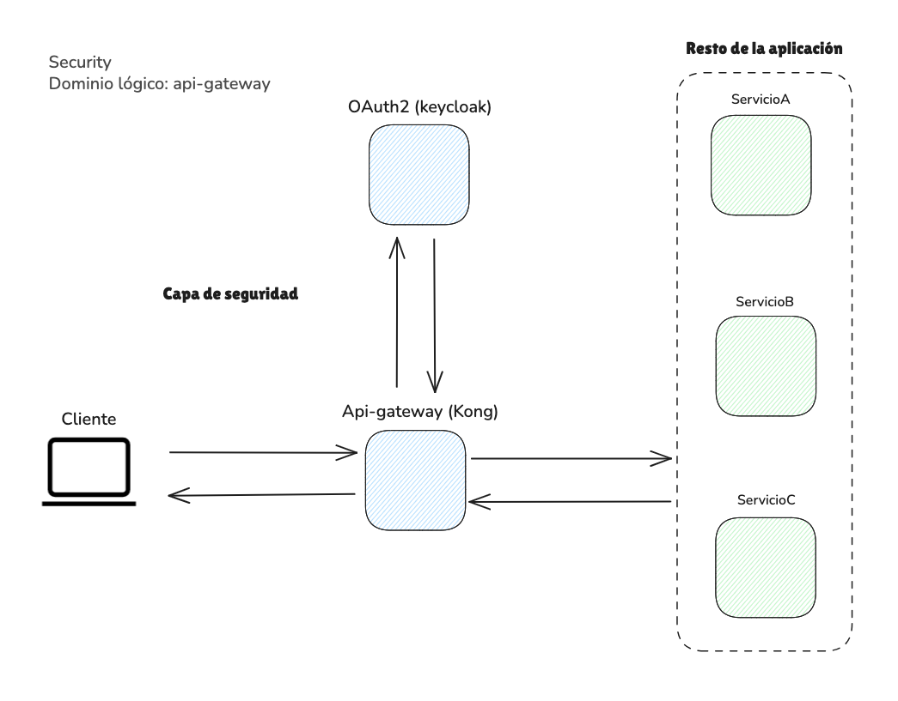

# Dominio Lógico: `security`

Este dominio lógico agrupa todos los componentes relacionados con la **seguridad del sistema**, el **control de acceso**, y la **gestión del tráfico externo**. Incluye servicios críticos como balanceadores de carga, servidores de autenticación (OAuth2/OpenID Connect), y API Gateways.

La agrupación bajo un solo dominio lógico permite mantener una estructura **modular, escalable y organizada**, facilitando la gestión de configuraciones, despliegues y políticas de seguridad.

---

## Estructura General
📂 Estructura del Dominio Lógico
```bash
TrackingSystemIOT/    # Raíz del proyecto
│ 
├──security/     # Dominio lógico  
│  ├── load-balancer/     # Encargado de distribuir tráfico y aplicar primeras reglas de acceso 
│  ├── oauth2/            # Gestión de identidad y autenticación 
│  ├── api-gateway/       # Enrutamiento y seguridad de APIs
│  ├── test/              # scripts para realizar pruebas de integracion entre los servicios oauth2 y el api gateway.
│  └── docker-compose.auth.yml/   # Archivo Docker compose para gestionar volumenes,servicios, redes.
│
├──ingest-process/
.
.
.
```
---
## Arquitectura

<!--  -->

---

## Ventajas de esta estructura

- **Claridad organizacional:** Cada subcarpeta representa una responsabilidad clara.
- **Escalabilidad:** Permite agregar nuevos servicios o reemplazar componentes sin modificar la estructura general.
- **Aislamiento lógico:** Mejora la mantenibilidad, testeo, y despliegue independiente por dominio.
- **Seguridad centralizada:** Agrupa todos los puntos de entrada y control de acceso del sistema.
- **Facilidad de documentación:** Cada subdominio puede incluir sus propias configuraciones y documentación específica.
- **Compatibilidad con infraestructura como código:** Se adapta fácilmente a herramientas como Terraform, Helm o Ansible.

---

## Subdominios lógicos

### 1. `load-balancer/`

Contiene servicios responsables de recibir el tráfico externo y distribuirlo internamente de forma eficiente. También puede encargarse de tareas básicas de seguridad como TLS, redirecciones y restricciones IP.

**Ejemplo de componentes:**
- Nginx
- HAProxy
- Envoy

**Posibles carpetas internas:**
- `config/`: Archivos de configuración.
- `tls/`: Certificados TLS/SSL.
- `rules/`: Reglas de redireccionamiento o filtrado.

---

### 2. `oauth2/`

Contiene los servicios de **autenticación y autorización** bajo protocolos como OAuth2, JWT o OpenID Connect. Estos servicios gestionan usuarios, clientes, roles y sesiones.

**Ejemplo de componentes:**
- Keycloak
- Auth0
- IdentityServer

**Posibles carpetas internas:**
- `realms/`: Configuraciones de reinos (realms).
- `clients/`: Definiciones de clientes registrados.
- `themes/`: Personalización de interfaces de login.

---

### 3. `api-gateway/`

Responsable del enrutamiento seguro de peticiones a los microservicios internos. Aplica políticas de acceso, autenticación, rate limiting, y logging.

**Ejemplo de componentes:**
- Kong
- Tyk
- Apigee
- Amazon API Gateway

**Posibles carpetas internas:**
- `plugins/`: Configuración de plugins de autenticación o control de tráfico.
- `routes/`: Definiciones de rutas y enrutamiento.
- `services/`: Servicios backend expuestos vía API Gateway.

---

## Recomendaciones

- Documentar cada subcarpeta con un `README.md` propio.
- Versionar configuraciones críticas (ej. `realms/` de Keycloak).
- Usar entornos separados para pruebas de cambios en gateways o autenticación.
- Validar configuraciones con pruebas automatizadas donde sea posible.

---

**Última actualización:** 27 de mayo de 2025


---